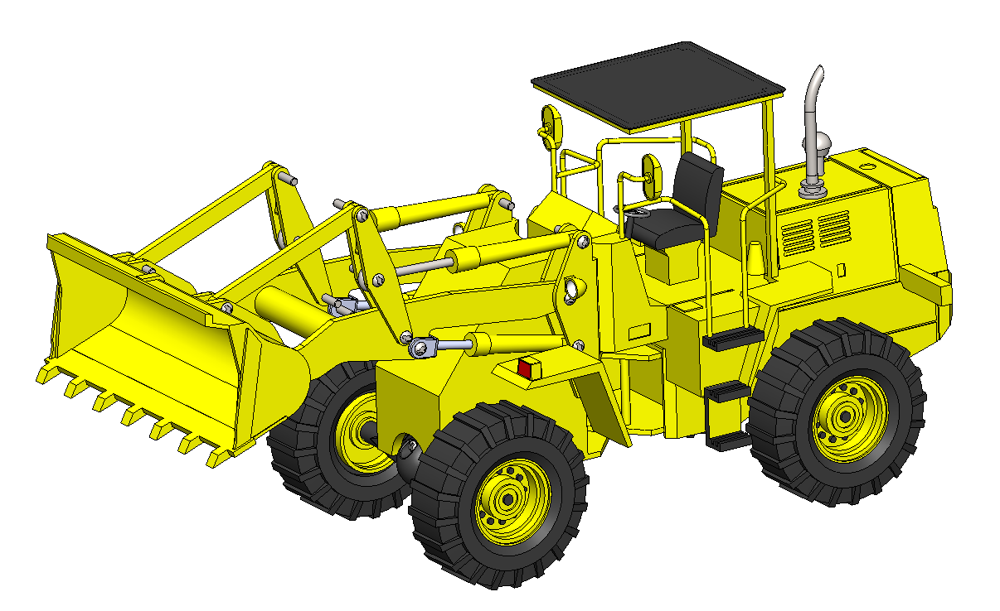

# Wheel Loader – SolidWorks Design

This repository contains the 3D CAD model of a wheel loader developed using SolidWorks. The model features a detailed chassis, articulated steering, hydraulic cylinders, and a functional loader bucket, designed for realism, engineering visualization, and educational use.


- Functional loader bucket with hydraulic cylinders  
- Detailed operator cabin and chassis  
- Realistic wheel and tire assemblies  
- Modular design for easy modification and simulation

## Applications

- Engineering and mechanical design education  
- Simulation and visualization of construction machinery  
- Prototyping and mechanical system demonstrations  
- STEM and robotics projects

## Repository Contents

- SolidWorks Assembly File (`.SLDASM`)  
- SolidWorks Part Files (`.SLDPRT`)  
- Assembly image preview (`.jpg`)

## Requirements

- SolidWorks 2021 

## How to Use

1. Clone the repository:
   ```
   git clone https://github.com/EakamjitSingh/Wheel-Loader.git
   ```
2. Open the assembly file in SolidWorks.
3. Modify, simulate, or export components as required.

